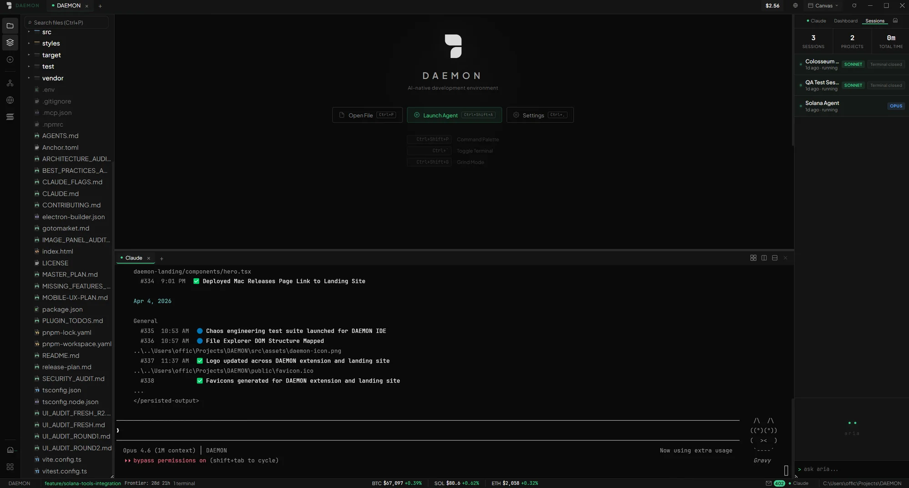
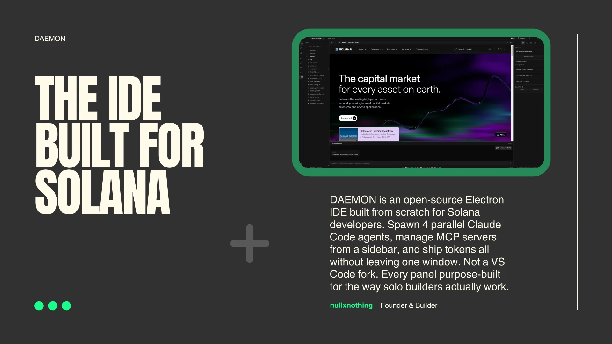
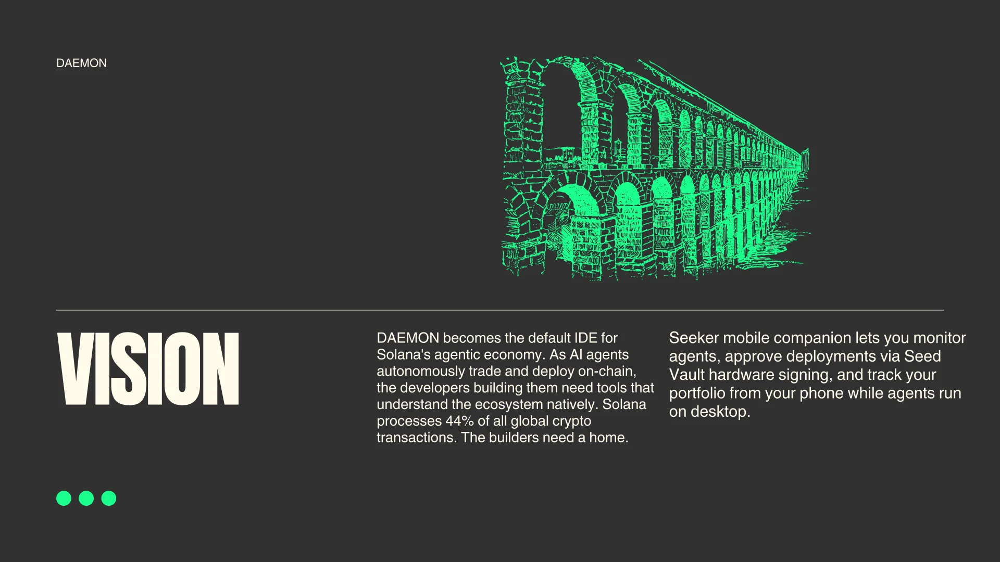
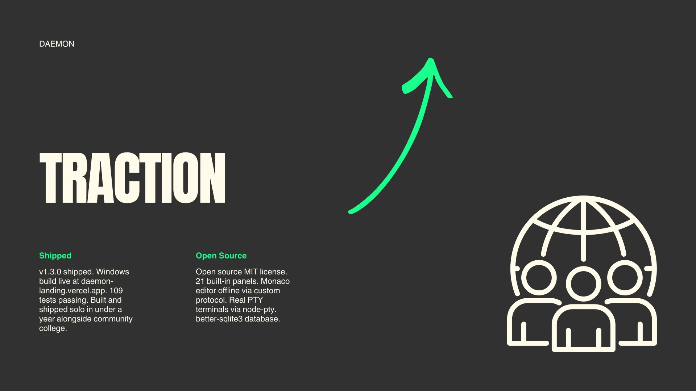

<p align="center">
  <h1 align="center">DAEMON</h1>
  <p align="center">An open-source IDE built for AI-native development.</p>
</p>

<p align="center">
  
  
  
  
</p>

<p align="center">
  <a href="#install">Install</a> &middot;
  <a href="#features">Features</a> &middot;
  <a href="#architecture">Architecture</a> &middot;
  <a href="#development">Development</a> &middot;
  <a href="CONTRIBUTING.md">Contributing</a>
</p>

---

<p align="center">
  
</p>

**[Watch the demo video](https://daemon-landing.vercel.app/daemon-demo.mp4)** — 60-second walkthrough of the IDE in action.

DAEMON is a standalone Electron IDE designed around AI agent workflows. It ships a Monaco editor, integrated PTY terminals, Claude Code agent spawning, MCP server management, a Git panel, a Solana wallet, and a plugin system — all purpose-built from scratch. Not a VS Code fork.

## Install

**Windows:** Download the [latest .exe](https://pub-1996550623c84fbeb15c66144b09e41e.r2.dev/DAEMON-2.0.0-setup.exe)

<a name="mac-install"></a>

**Mac:** Build from source (signed builds coming soon):

```bash
git clone https://github.com/nullxnothing/daemon.git
cd daemon
pnpm install
pnpm run build
pnpm run package
```

The `.dmg` will be in `release/2.0.0/`. Drag to Applications. On first launch, right-click > Open to bypass Gatekeeper (not yet signed/notarized).

<a name="linux-install"></a>

**Linux:** Build from source (AppImage builds coming soon):

```bash
git clone https://github.com/nullxnothing/daemon.git
cd daemon
pnpm install
pnpm run build
pnpm run package
```

The AppImage will be in `release/2.0.0/`. Make it executable with `chmod +x` and run directly.

**Build from source (any platform):**

```bash
git clone https://github.com/nullxnothing/daemon.git
cd daemon
pnpm install
pnpm run package
```

Requires **Node.js 22+** and **pnpm 9+**.

## Features

<p align="center">
  
</p>

**Editor** — Monaco running fully offline via a custom protocol handler. Multi-tab, breadcrumbs, syntax highlighting, Ctrl+S save. No CDN dependency.

**Terminal** — Real PTY sessions powered by node-pty and xterm.js. Multiple tabs, split panes, command history search (Ctrl+R), tab-completion hints, and dedicated agent session management.

<p align="center">
  
</p>

**Agent Launcher** — Spawn Claude Code agents with custom system prompts, model selection, and per-project MCP configurations. Agents run as real CLI sessions in dedicated terminal tabs.

**MCP Management** — Toggle project-level and global MCP servers from the sidebar. Changes write directly to `.claude/settings.json` and `.mcp.json` with a restart indicator when configs change.

**Git** — Branch switching, per-file and folder-level staging, commit, push, stash save/pop, branch creation, and tag management.

**Wallet** — Live Solana portfolio tracking via Helius. SOL balance and SPL token holdings with USD values from Jupiter.

<p align="center">
  
</p>

**Settings** — API keys encrypted via the OS keychain. MCP integrations, agent defaults, and display preferences.

**Tools Browser** — Create, import, and run scripts (TypeScript, Python, Shell) with per-language execution.

**Embedded Browser** — Built-in browser with a security sandbox for previewing and testing.

**PumpFun Integration** — Token launches and bonding curve interactions directly from the IDE.

**Multi-Project Tabs** — Tabbed project switching with per-project terminal sessions, MCP configs, and file trees. Context switching without losing state.

**Plugin System** — Extensible architecture for loading additional panels and integrations.

## Architecture

```
electron/
  main/           App entry, window management, protocol handlers
  ipc/            One handler per domain (agents, git, terminal, wallet, ...)
  services/       Business logic — never imported from renderer
  db/             SQLite (WAL mode), versioned migrations

src/
  panels/         One directory per UI panel
  store/          Zustand state management
  plugins/        Plugin registry, lazy-loaded components
  components/     Shared UI primitives

styles/           CSS custom properties and base reset
```

Key decisions:
- All database access runs in the main process. The renderer communicates exclusively via IPC.
- Every IPC handler returns `{ ok, data }` or `{ ok, error }` — no raw throws across the bridge.
- Native modules (`better-sqlite3`, `node-pty`) are unpacked from ASAR for production builds.
- Monaco runs offline through a custom `monaco-editor://` protocol — zero network requests.
- CSS Modules with a design token system. No utility CSS frameworks.

## Tech Stack

| Layer | Technology |
|-------|-----------|
| Shell | Electron 33 |
| Build | Vite |
| UI | React 18, TypeScript |
| Editor | Monaco Editor |
| Terminal | node-pty, xterm.js |
| State | Zustand |
| Database | better-sqlite3 (WAL) |
| Git | simple-git |
| Packaging | electron-builder |

## Development

```bash
pnpm install          # Install dependencies and rebuild native modules
pnpm run dev          # Dev server with hot reload
pnpm run typecheck    # TypeScript validation
pnpm run test         # Run tests (Vitest)
pnpm run build        # Production build
pnpm run package      # Create distributable (.exe / .dmg)
```

See [CONTRIBUTING.md](CONTRIBUTING.md) for guidelines on pull requests and code style.

## License

[MIT](LICENSE)
