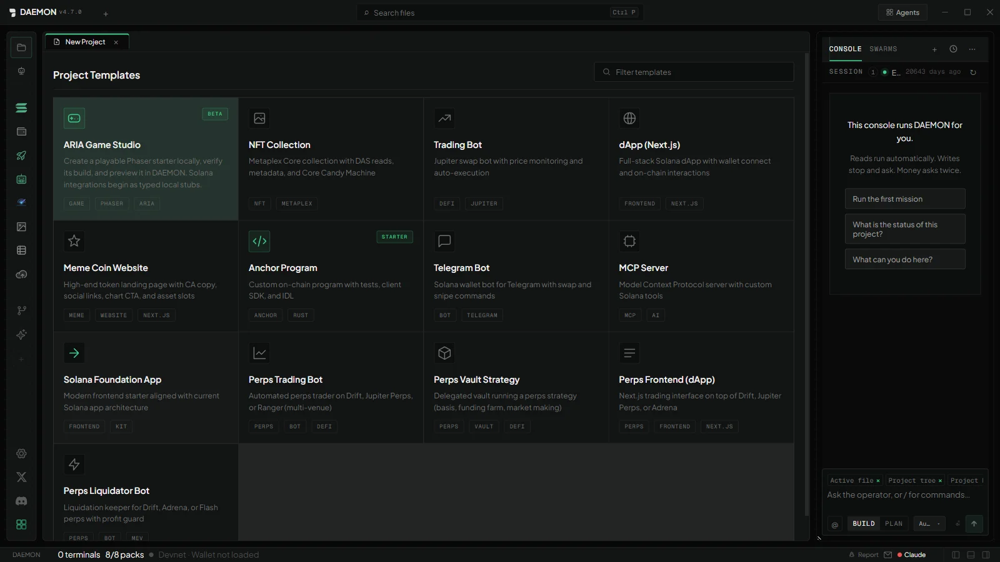

<p align="center">
  <h1 align="center">DAEMON</h1>
  <p align="center"><strong>AI agents that work inside your Solana stack, under your authority.</strong></p>
  <p align="center">Build, inspect, and operate from one local-first workbench. Writes, Git pushes, and fund movement stay behind explicit review.</p>
</p>

<p align="center">
  
  
  
  
</p>

<p align="center">
  <a href="https://daemon-landing.vercel.app">Website</a> &middot;
  <a href="#install">Install</a> &middot;
  <a href="#features">Features</a> &middot;
  <a href="#daemon-ai-and-access">DAEMON AI</a> &middot;
  <a href="FRONTIER_SUBMISSION.md">Frontier</a> &middot;
  <a href="#architecture">Architecture</a> &middot;
  <a href="#development">Development</a> &middot;
  <a href="CONTRIBUTING.md">Contributing</a>
</p>

---

<p align="center">
  
</p>

**[Frontier demo runbook](FRONTIER_SUBMISSION.md#2-minute-demo-runbook)** — 2-minute submission flow from project open to devnet settlement.

DAEMON is a focused Windows workbench for Solana builders who want one persistent AI conversation beside real project files, a scoped terminal, guarded local workflows, and live meme-tech evidence. It is local-first and does not hand agents silent authority over code, keys, Git, or funds.

## How authority works

1. **Inspect:** enabled read tools gather project, Git, wallet, and runtime context.
2. **Review:** writes pause for approval. Guarded sensitive flows use typed checks, and direct Autopilot arming ends in an OS-native review of every bound mainnet term.
3. **Verify:** diffs, test output, signatures, and explorer links keep results inspectable after execution.

The free tier stays free for local work and bring-your-own-key AI. Advanced trading, launch, and hosted AI surfaces are optional capability packs, not prerequisites for the core build loop.

## Install

**Windows:** Download the [latest .exe](https://github.com/nullxnothing/daemon/releases/latest/download/DAEMON-setup.exe)

<a name="mac-install"></a>

**Mac and Linux:** The canonical packaged release is currently Windows-only. Build the repository from source for development:

```bash
git clone https://github.com/nullxnothing/daemon.git
cd daemon
pnpm install
pnpm run build
```

**Build the canonical Windows installer from source:**

```bash
git clone https://github.com/nullxnothing/daemon.git
cd daemon
pnpm install
pnpm run package:lite
```

Requires **Node.js 22+** and **pnpm 9+**.

The installer is written to `release-lite/<version>/DAEMON-setup.exe`.

## Focused workbench

- **Conversation:** project-scoped sessions, bring-your-own-key models, and encrypted local credentials.
- **Code:** bounded project import, recursive explorer, offline Monaco, dirty-file protection, and explicit save states.
- **Terminal:** real project-scoped PTYs with visible exit and error states.
- **Meme Tech:** repo topology, Birdeye and DEX market context, provider divergence, and read-only token-risk evidence.
- **Wallet, Trade, Scanner:** optional tools behind the same guarded shell. Wallet addresses remain watch-only by default.

## Features

**Editor** — Monaco running fully offline via a custom protocol handler. Multi-tab, breadcrumbs, syntax highlighting, Ctrl+S save. No CDN dependency.

**Terminal** — Real PTY sessions powered by node-pty and xterm.js. Multiple tabs, split panes, command history search (Ctrl+R), tab-completion hints, and dedicated agent session management.

**Agent Launcher** — Spawn Claude Code agents with custom system prompts, model selection, and per-project MCP configurations. Agents run as real CLI sessions in dedicated terminal tabs.

**ARIA Game Studio Beta:** Create a playable local Phaser starter, install dependencies, verify a
production build, and open the preview inside DAEMON. With approval, ARIA can send one focused
`build_game` lane into a separate Git worktree. The starter has typed seams for future Solana
integration, but the beta uses local stubs. It does not connect a live wallet, write onchain, mint,
publish, or deploy. `deploy_app` opens the Deploy panel for a manual handoff.

**VS Code-style shell + capability packs** — Explorer, editor, a bottom-panel terminal, and the DAEMON Console on the right rail. Domain features ship as toggleable capability packs (Solana, Wallet, Launch, Agents, Memory, Sites, Markets, Create); disabling a pack quiesces its tools, integrations, sidebar icon, console commands, and background work — IPC handlers included. The Capability Manager shows how many packs are active and how much backend work is idle.

**DAEMON Console (ARIA operator)** — The right-rail AI operator drives the whole IDE from natural language, chat-first with `>` and `/` command accelerators. Per-project chat sessions (new / switch / rename / archive / delete) with memory that survives restarts and compounds: the console proposes durable facts after real work (Keep/Dismiss), cites which taught facts a turn drew on, and strengthens proven facts over time. It runs DAEMON itself — agent wallets, token preflight/launch, Flywheel config, git — through a registry of typed tools with typed confirmation for sensitive on-chain actions (and a `[MAINNET]` guard). It never pushes to git autonomously.

**ARIA Autopilot (experimental):** Bounded mainnet mandates run on a fixed cadence after a typed review of the wallet, mint, clip, exposure cap, slippage, and exits. The Desk shows estimated P&L and an action tape. Every tick claims its ledger row before it swaps, so a crash mid-tick is held for review, never replayed into a double-buy; a cluster switch auto-holds armed mandates; unattended slippage and price impact are capped tighter than a human-confirmed trade. Disarming stops future ticks, but a submitted swap may still settle.

**Hyperliquid (via HypurrClaw)** — ARIA reads Hyperliquid markets and trades perps/spot by driving the agent-first `hyperliquid` CLI through a single execFile gate (no raw shell). Network defaults to testnet, DAEMON never holds a Hyperliquid key (the CLI's encrypted wallet signs), and every signing action stops for typed confirmation with an `[HL-MAINNET]`/`[HL-TESTNET]` marker.

**Execution fee meter** — Agent-routed SOL transfers on mainnet carry a transparent fee line surfaced on the approval card before anything runs, never charged silently. The rate is config-driven (default 0.25%, hard ceiling 0.75%), devnet is always free, and it stays disabled until a treasury is configured. Jupiter swaps sign a prebuilt transaction and are not fee-metered.

**Agent bridge (MCP)** — A loopback MCP server with bearer-token auth exposes DAEMON's gated wallet, launch, and memory tools to external agents (Cursor, Claude Code). Every call re-filters against enabled packs, file reads deny secret-bearing paths, and sensitive actions route through the same approval gate as ARIA.

**Agent economy control tower** — Track agent-routed execution, fees, and paid-resource (x402/IDLE) activity in one panel, with policy-and-budget-gated paid calls and redacted receipts.

**Agent Swarms** — Launch several tasks in parallel, each in its own isolated git worktree and branch, driven by a separate headless Claude agent with a minimal allowlisted env and push disabled at the git layer. The Swarms tab shows live run/lane status; each lane writes a `RESULTS.md`. Concurrency is capped, worktrees are cleaned up automatically, and merging stays a manual, reviewed step.

**Venum** — First-class Solana execution provider in the Markets pack: live/batch prices and ranked swap quotes, with read-tier ARIA tools and an Integration Command Center card.

**MCP Management** — Toggle project-level and global MCP servers from the sidebar. Changes write directly to `.claude/settings.json` and `.mcp.json` with a restart indicator when configs change.

**Git** — Branch switching, per-file and folder-level staging, commit, push, stash save/pop, branch creation, and tag management.

**Wallet** — Live Solana portfolio tracking via Helius. SOL balance and SPL token holdings with USD values from Jupiter.

**Settings** — API keys encrypted via the OS keychain. MCP integrations, agent defaults, and display preferences.

**Tools Browser** — Create, import, and run scripts (TypeScript, Python, Shell) with per-language execution.

**Embedded Browser** — Built-in browser with a security sandbox for previewing and testing.

**PumpFun Integration** — Token launches and bonding curve interactions directly from the IDE.

**Editor settings** — Font family/size, tab size, word wrap, minimap, and theme configurable in Settings › Display and applied to Monaco live, including a `daemon-light` theme.

**Multi-project switching** — Per-project terminal sessions, MCP configs, wallets, and file trees. Context switching without losing state.

## DAEMON AI and Access

DAEMON AI is the hosted agent layer for project-aware chat, patch workflows, Solana-aware development help, model routing, usage metering, and premium workflows. Free users can use local/BYOK mode; paid users and eligible holders can use DAEMON-hosted AI through DAEMON AI Cloud.

| Plan | Price | Positioning |
|------|------:|-------------|
| DAEMON Light | Free | Local workbench, editor, terminal, git, wallet, BYOK agents, and core tools. |
| DAEMON Pro | $20/month | Hosted DAEMON AI, Pro Skills, Arena, MCP sync, and standard monthly usage. |
| DAEMON Operator | $60/month | Higher AI limits, larger context, cloud agents, and advanced ship/deploy workflows. |
| DAEMON Ultra | $200/month | Maximum individual usage, priority model access, early features, and advanced automation. |
| DAEMON Teams | $49/user/month | Shared workspaces, pooled usage, team billing, admin controls, and collaboration. |
| Enterprise | Custom | Private deployments, custom limits, support, compliance, and invoicing. |

Holder access starts with a simple rule: hold 1,000,000 $DAEMON to claim DAEMON Pro with included monthly AI usage. Higher holder tiers can unlock higher limits, discounts, badges, and early access later. Holder access does not mean unlimited AI usage.

**$DAEMON contract address:** `4vpf4qNtNVkvz2dm5qL2mT6jBXH9gDY8qH2QsHN5pump`

DAEMON also includes a Zauth integration surface for x402 database and Provider Hub management. Payment and entitlement enforcement should remain server-side through DAEMON AI Cloud and the relevant provider backends.

## Architecture

```
electron/
  main/           App entry, window management, protocol handlers
  ipc/            One handler per domain (agents, git, terminal, wallet, ...)
  services/       Business logic — never imported from renderer
    daemon-ai-cloud/  Standalone hosted DAEMON AI server (Express, deployed separately)
  db/             SQLite (WAL mode), versioned migrations

src/
  panels/         One directory per UI panel
  store/          Zustand state management
  plugins/        Plugin registry, lazy-loaded components
  components/     Shared UI primitives

styles/           CSS custom properties and base reset
```

Key decisions:
- All database access runs in the main process. The renderer communicates exclusively via IPC.
- Every IPC handler returns `{ ok, data }` or `{ ok, error }` — no raw throws across the bridge.
- Native modules (`better-sqlite3`, `node-pty`) are unpacked from ASAR for production builds.
- Monaco runs offline through a custom `monaco-editor://` protocol — zero network requests.
- CSS Modules with a design token system. No utility CSS frameworks.

## Tech Stack

| Layer | Technology |
|-------|-----------|
| Shell | Electron 41 |
| Build | Vite |
| UI | React 19, TypeScript |
| Editor | Monaco Editor |
| Terminal | node-pty, xterm.js |
| State | Zustand |
| Database | better-sqlite3 (WAL) |
| Git | simple-git |
| Packaging | electron-builder |

## Development

```bash
pnpm install          # Install dependencies and rebuild native modules
pnpm run dev          # Dev server with hot reload
pnpm run typecheck    # TypeScript validation
pnpm run test         # Run tests (Vitest)
pnpm run build        # Production build
pnpm run package      # Create distributable (.exe / .dmg)
```

### DAEMON AI Cloud

The hosted DAEMON AI service is a standalone Express server built and run separately from the desktop app:

```bash
pnpm run build:daemon-ai-cloud      # Bundle the cloud server to dist-cloud/
pnpm run start:daemon-ai-cloud      # Run the bundled server (reads env config)
pnpm run test:daemon-ai:cloud-local # Build + local smoke against an in-process server
pnpm run test:daemon-ai:live        # Smoke against a deployed server (requires JWTs)
```

See [docs/DAEMON_AI_CLOUD_API.md](docs/DAEMON_AI_CLOUD_API.md) for the HTTP API reference and [docs/internal/DAEMON_AI_CLOUD_DEPLOYMENT.md](docs/internal/DAEMON_AI_CLOUD_DEPLOYMENT.md) for the deployment runbook.

See [CONTRIBUTING.md](CONTRIBUTING.md) for guidelines on pull requests and code style, and [DESIGN_SYSTEM.md](DESIGN_SYSTEM.md) for the UI design system (tokens, primitives, and panel patterns).

## License

[MIT](LICENSE)
